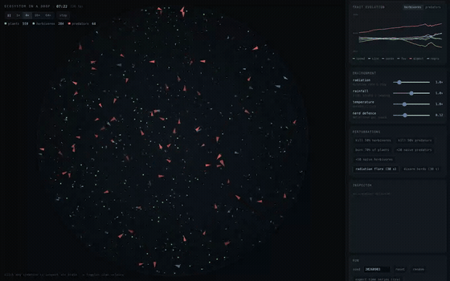

# Ecosystem in a Drop

A closed petri dish with three trophic levels — vegetation, herbivores, predators.
Nobody is trained and nothing is scripted: every animal carries its own 18→8→3
neural network, and the only optimiser is *dying without offspring*.

Zero runtime dependencies. Vanilla TypeScript, one Canvas2D surface, all state in
typed arrays (struct-of-arrays), single threaded, deterministic from a seed.



A 12-second clip from partway through a run. The full [~98s recording](docs/demo.mp4)
starts at generation 0 and walks through a predator cull and a radiation flare before
this fast-forward segment.

```bash
npm install
npm run dev        # http://localhost:5173
npm run lab        # headless experiment runner, prints a time series
```

---

## The model

The dish is **energetically closed**. One number — 200 000 units — is split between
the soil, the plants, and the flesh of the animals, and every transaction moves it
between those pools. Nothing is created, nothing leaks; respiration returns energy
to the soil as surely as a corpse does. `audit()` re-adds the whole dish every frame
and the panel prints it, so any drift is visible immediately.

That single constraint is what makes the population dynamics real rather than
decorative: a herbivore boom is *literally* the soil pool moving into cyan triangles.

| Process | Mechanism |
| --- | --- |
| Plant growth | Monod uptake: `grow · soil/(soil + K)`. Vegetation stalls as the soil empties. |
| Plant recruitment | Seeds land near a parent (75 %) or anywhere (25 %) and fail if another plant is within 15 px — **self-thinning**, so the lawn has a spatial carrying capacity instead of an arbitrary cap. |
| Feeding | Contact with the mouth radius, then a **handling time** before the next meal (Holling type II). Without it a predator has an unbounded kill rate and the system always collapses. |
| Predation | **Gape limitation**: a predator can only swallow prey smaller than `size / 1.2`. This is what keeps the food chain a chain — and it is the mechanism behind the size arms race described below. |
| Intraguild predation | Predators are prey to each other: one can eat a rival below `size / 1.35`. Cannibalism gives the top level something to fall back on when herbivores are scarce, and it puts a permanent premium on being the bigger animal. |
| Dominance contests | Rivals too close in size to eat each other still burn energy on interference when they meet (`contestCost` per rival per second within 35 px). This is a density-dependent brake on the predator population that costs no prey. |
| Herd defence | An attack on a herbivore is broken off with probability `d/(1+d)`, where `d = defK · (clan-mates within 34 px) / attacker size`. The attacker pays for the failed rush. Nothing here makes herbivores group — it only makes grouping *pay*, and leaves the behaviour to evolution. |
| Clan markers | Every herbivore carries a heritable marker in [0,1) that drifts a little each generation and is under no selection of its own. Only creatures whose markers differ by less than 0.06 count as each other's defenders, so "who is my tribe" is inherited rather than assigned. Herbivores are tinted by marker in the dish (`c` toggles it). |
| Reproduction | Offspring get a fixed provision of their own capacity plus their structural biomass, paid by the parent. Newborns are therefore always viable and only the parent gambles — this removes the "divide at any cost" suicide spiral that kills naive predator–prey sims. |
| Death | Starvation or old age. Body and reserves go back to the soil. |
| Metabolism | `base·(0.4+0.6·size²) + move·(v/v₀)²·size + sense·range + digest·efficiency`. Every trait has a running cost, so nothing is free to maximise. |

### The brain

Each animal has a fixed-topology MLP with 179 weights, stored inline in the
population's flat `Float32Array`.

```
18 inputs → 8 hidden (tanh) → 3 outputs (tanh)
```

Vision is a cone of `fov` radians split into **5 sectors**, and each sector reports
the nearest object on **3 channels** (15 values). The channels are relative to the
species:

| | channel 0 "food" | channel 1 "kin" | channel 2 "risk" |
| --- | --- | --- | --- |
| herbivore | plants | herbivores | predators |
| predator | herbivores | predators | plants |

Plus normalised energy, local crowding of its own species, and a bias. Note that
the "kin" channel is what an animal would need in order to seek out its own herd —
whether it learns to use that way is an open question in this model, see below.
Outputs are thrust, turn and *divide now*. Select any creature to see its live cone in the dish
and its live activations in the panel.

### Heritable traits

`speed · size · sense range · field of view · digestive efficiency · reproduction
threshold`, each mutated by a gaussian step at birth, each clamped to a range, each
paid for through metabolism. The trait chart plots the population mean of all six,
normalised to their own limits.

---

## What to watch for

Numbers below are from seed 4242, measured with `tools/exp.ts` — your seed will
differ in detail, not in kind.

- **Lotka–Volterra cycles.** The phase portrait (prey → predator) traces a genuine
  orbit rather than a point. Prey peak, predators follow about a quarter-cycle later.
- **A size arms race.** Gape limitation means prey that grow bigger become
  uneatable; predators answer by growing too, until the metabolic cost of a large
  body bites. In most seeds herbivore mean size climbs for a few hundred seconds,
  predator size chases it up (1.3 → 2.2 is typical), and then the prey lineage
  switches strategy — small, cheap and fast — and predator size falls back behind it.
  It is visible in the dish before it is visible in the chart.
- **Predator release, and how quickly it heals.** Killing 90 % of the predators does
  *not* cause a runaway: herbivores rise (219 → 280), vegetation dips about 30 %
  (616 → 441), and the predators are back to full strength within ~300 s. The dish
  is a damped system, not a knife edge — which is precisely why it survives long
  enough to be interesting.
- **The top of the chain is the fragile part.** Every stress tested so far removes
  the predators first and leaves a working two-level ecosystem behind:

  | perturbation | outcome after 900 s |
  | --- | --- |
  | radiation ×8 | predators extinct within 150 s (too small a population to hold its behaviour against the mutation load); herbivores unaffected |
  | rainfall ×0.35 | everything shrinks by half, predators extinct, herbivores persist at ~120 |
  | temperature ×2 | predators extinct within ~400 s, herbivores *rise* — the release outweighs the extra cost |

  There is no immigration, so an extinct level stays extinct. Use *+20 naive
  predators* to reseed one and watch a random-brained population get selected into
  competence over a few hundred seconds.
- **Predators eat each other.** Cannibalism is a real but minor channel: 0.5–3 % of
  all predator kills, and it roughly triples during a prey trough (0.5 % → 1.9 % on
  the default seed between t=900 and t=3600), which is when it matters — the top
  level cannibalises its way through a shortage instead of simply starving out.
  Dominance contests between same-size rivals add a density-dependent brake that
  costs no prey at all.
- **Herds are used, but they are not chosen.** This is the most interesting negative
  result in the model, and it is worth stating plainly: herd defence *works* —
  10–25 % of attacks are broken off by the target's clan-mates — but it does **not**
  cause herding to evolve. Measured against a matched control on the same seed, the
  aggregation index is 0.78–0.89 with defence off and 0.82–0.99 with it on, over
  2400 s. The mild clumping you can see in the dish is the patchy vegetation, not
  anti-predator behaviour. Three payoff shapes were tried:

  | herd bonus | result |
  | --- | --- |
  | linear, strong (`defK` 0.42) | no herding; predators extinct by t≈500 |
  | convex threshold (`(n-1)^1.4`) | no herding — a herd is valuable but no individual step toward one pays, so selection has nothing to climb |
  | linear, gentle (shipped: `defK` 0.12, r 34 px) | no herding; predators oscillate 22–56 with no extinction over 3600 s |
  | linear over a wide radius (r 60 px) | no herding; protection scales with prey density and predators decline 89 → 17 |

  So the dish gives you the *opportunity* for tribes and the animals decline to take
  it. Whether that is a limit of a 5-sector nearest-neighbour eye, of an 8-unit
  hidden layer, or of the trade-off against grazing competition is exactly the sort
  of thing the aggregation chart and the *disarm herds* button are there to test.
- **Clans are real even when herds are not.** The inherited marker collapses from ~18
  effective variants to 3–4 within a few hundred seconds and stays there — a handful
  of lineages own the dish, and you can see them as distinct tints. That is drift and
  selective sweeps, not tribal warfare; do not read more into it than that.
- **The energy budget bar** under the state readout is the whole story in one line:
  a healthy dish keeps most of its energy in the soil; a dying one has it stranded in
  biomass that nothing can eat.

## Controls

| | |
| --- | --- |
| `Space` | pause / resume |
| `.` | single tick |
| `v` | toggle the vision cone of the selected creature |
| `c` | toggle clan tinting of the herbivores |
| click | inspect a creature (traits, energy, live network) |

**Environment** — radiation (mutation rate and step), rainfall (plant growth and
seeding), temperature (metabolic cost), and herd defence. All four are live;
changing them mid-run is the point.

Herd defence is a slider rather than a constant because it is a genuine trade-off
and the interesting part is the shape of it, not any one setting:

| `defK` | attacks repelled | predators |
| --- | --- | --- |
| 0.10 | ~3 % | oscillate 22–141, stable over 3600 s |
| 0.12 (default) | 3–6 % | oscillate 22–56, no extinction over 3600 s on either seed tested |
| 0.15 | 10–25 % | survive on some seeds, collapse to <5 on others |
| 0.42 | most | extinct by t≈500 |

Safety for the prey is bought directly out of the predators' food budget. There is
no setting that gives you both a strongly defended herd and a healthy top predator —
which is itself the result.

**Perturbations** — culls, a fire, naive immigrants, a 30 s radiation flare, and
*disarm herds*, which switches herd defence off for 30 s so you can see how much of
the herbivores' survival is actually coming from standing together.

**Run** — seed, reset, and CSV export of the whole recorded time series.

### URL parameters

`?seed=123&speed=4&warmup=900&inspect=herb`

`warmup` runs N simulated seconds headlessly before the first frame, so you can open
straight into an equilibrium instead of watching the founding generations.

## Headless lab

```bash
npm run lab -- --secs 1800 --seed 7 --every 60
npm run lab -- --secs 900 --set env.drought=0.5 --set mut.rate=0.4
npx vite-node tools/exp.ts -- drought      # perturb a settled dish, print the response
```

Prints populations, per-interval event counts (grazing, kills, births, starvation,
old age), mean traits, mean generation, an energy-conservation check and a
throughput figure. `--set a.b=c` reaches any field of `src/sim/config.ts`, which is
where every tunable number in the model lives.

## Layout

```
src/core/rng.ts        mulberry32 + gaussian, the single source of randomness
src/core/grid.ts       uniform spatial hash, counting-sorted, rebuilt each tick
src/core/history.ts    ring buffer of named series + CSV
src/sim/config.ts      every tunable number
src/sim/brain.ts       the MLP: layout, forward pass, inheritance
src/sim/world.ts       populations, senses, metabolism, the tick
src/render/view.ts     the dish
src/render/charts.ts   populations / phase portrait / social structure / traits
src/render/netview.ts  the selected brain
src/main.ts            loop, panel, input
tools/lab.ts           headless runner
```

Determinism: same seed + same parameters + same number of ticks ⇒ identical run.
Every random draw goes through one `Rng` instance owned by the world.
